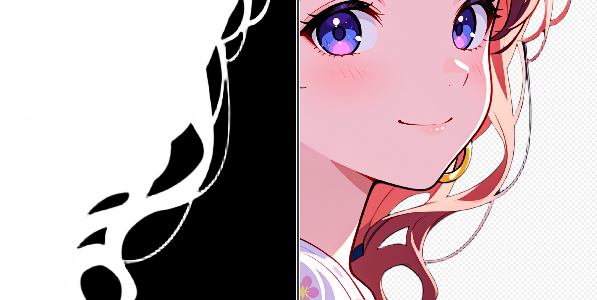
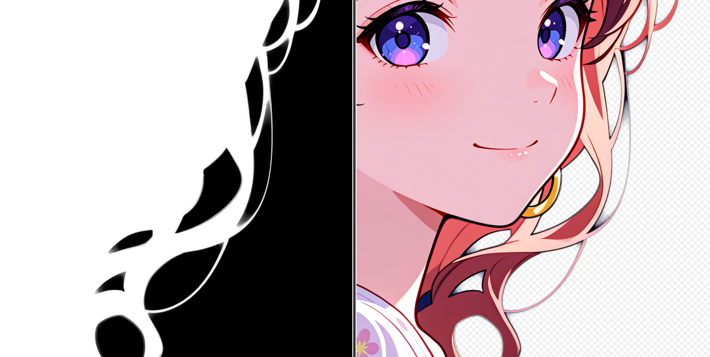
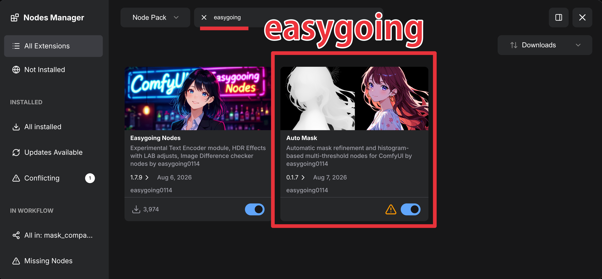

<div align="center">

</div>

# ComfyUI-AutoMask

- [**README (Japanese)**](README_JP.md)
- **Guide (External site)**: [English](https://www.ai-image-journey.com/2026/08/birefnet-depthanythingv3-sam31-lama.html) | [Japanese](https://note.com/ai_image_journey/n/nf45afca51b00)

Custom nodes for ComfyUI that automatically refine and threshold masks — no manual trial-and-error with black/white points or fixed cutoff values.

## Nodes

### Mask Refine

<div align="center">

</div>

**BiRefNet**

<div align="center">

</div>

**BiRefNet -> Mask Threshold = 0.01 -> Mask Refine**

<div align="center">

</div>

Refines a rough mask into a soft alpha matte using closed-form matting ([`pymatting`](https://github.com/pymatting/pymatting)), guided by the source image.

> This node is a simplified implementation based on the **Image Matting** node from [ComfyUI-Image-Filters](https://github.com/spacepxl/ComfyUI-Image-Filters) by [spacepxl](https://github.com/spacepxl), with `preblur` kept as the only exposed setting.

- **Inputs**
  - `image` — `IMAGE`, the source image the mask was drawn on
  - `mask` — `MASK`, the rough/binary mask to refine
  - `preblur` — `INT` (default `10`), Gaussian blur radius applied to the mask before it's converted into a trimap. Higher values soften hard mask edges before matting; `0` disables preblurring.
- **Output**: `MASK` — a refined, soft alpha matte

Use this after any rough segmentation (SAM 3.1, BiRefNet, manual paint, threshold, etc.) to get cleaner edges, especially around hair, fur, or semi-transparent regions.

### Auto Mask Threshold

<div align="center">

</div>

Analyzes a soft mask's value histogram and automatically finds meaningful threshold boundaries (valleys between peaks) instead of requiring a manually chosen cutoff.

- **Inputs**
  - `mask` — `MASK`, a soft (non-binary) mask, e.g. the output of Auto Mask Refine
  - `threshold` — `INT` (default `5`, range `1`–`8`), selects the n-th detected boundary (ascending) for the single-mask output
- **Outputs**
  - `mask_batch (x8)` — `MASK`, a batch of up to 8 binary masks, one per detected boundary
  - `mask` — `MASK`, the single binary mask selected by `threshold`
  - `histogram` — `IMAGE`, a rendered histogram showing the detected peaks/valleys and which one was selected (also shown in the node preview)

Internally the node finds up to 5 valleys between histogram peaks plus up to 3 minor minima inside the largest peak, giving up to 8 candidate thresholds to choose from — useful for quickly comparing where different cutoffs land without re-running the graph.

## Installation

### Via ComfyUI Manager (recommended)

Search for **"easygoing"** in Nodes Manager and install.

<div align="center">

</div>

### Manual

After enabling the ComfyUI Python virtual environment:

```bash
cd ComfyUI/custom_nodes
git clone https://github.com/easygoing0114/ComfyUI-AutoMask.git
cd ComfyUI-AutoMask
pip install -r requirements.txt
```

## Requirements

- ComfyUI
- `opencv-python`
- `numpy`
- `pymatting`
- `Pillow`

(`torch` and `folder_paths` are provided by ComfyUI itself.)

## Credits

- **Mask Refine** is a simplified reimplementation of the **Image Matting** node from [ComfyUI-Image-Filters](https://github.com/spacepxl/ComfyUI-Image-Filters) by [spacepxl](https://github.com/spacepxl).

## License

- [MIT](LICENSE)